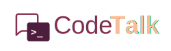

<p align="center">
	
	
	
	
<p>

<div align="center">
  
</div>

<div align="center">
  
  
  
  
  
  
  
  
  
  
  
  
  
  
</div>

---

CodeTalk is a Q&A web application built using React and NestJS. The platform is designed to enable developers to ask questions, share their knowledge, and assist each other in solving technical challenges. It serves as a hub for collaborative learning and problem-solving, fostering a community where expertise and insights can be exchanged.

## Table of Contents

- [Technology Stack:](#technology-stack)
- [Table of Contents](#table-of-contents)
- [Dependencies](#dependencies)
- [Project setup](#project-setup)
  - [Database setup](#database-setup)
  - [Starting the server](#starting-the-server)
- [Admin panel](#admin-panel)
- [API Documentation](#api-documentation)
- [License](#license)

## Features

- **User Registration and Authentication**. CodeTalk allows users to register and authenticate securely using email/password.

- **Role-Based Access Control**. The platform supports role-based access control (RBAC) to ensure that different users (admin or regular user) have appropriate permissions.

- **OAuth Integration with GitHub/Google**. Users can sign up or log in using their GitHub or Google accounts, streamlining the authentication process without needing to remember additional credentials.

- **Markdown Support in Posts**. CodeTalk supports Markdown syntax for writing posts, allowing users to format text, add images, and create rich, structured content in a simple and efficient way. The editor supports GitHub-flavored Markdown for easy integration with external resources.

- **Post Categories**. Posts are organized into categories, and users can filter content based on the tags associated with each post. This feature makes it easy for users to navigate the platform and find relevant content based on their interests.

- **Comment System**. Users can engage in discussions via a comment section under each post. Comments support threading and replies, facilitating deeper conversations.

- **Search Functionality**. The platform includes a search feature to quickly find posts, categories, or users based on keywords or tags.

- **Admin Panel**. CodeTalk comes with an admin panel for managing users, posts, comments, and other platform resources. Admins can view and manage content with ease, ensuring smooth platform operation.

- **API Documentation with Swagger**
  A fully interactive API documentation is available via Swagger, providing details on available endpoints, request/response formats, and sample queries. This makes it easier for developers to integrate with the CodeTalk API.

## Technology Stack:

### Backend

- NestJS, Node.js
- PostgreSQL
- Redis
- Prisma
- JWT with Passport.js for secure user authentication
- Swagger for API documentation

### Frontend

- React
- Redux
- MUI

## Dependencies

The project relies on the following technologies:

- [Node.js](https://nodejs.org/en) v16.x or higher.
- [NPM](https://www.npmjs.com) v7.x or higher.
- [PostgreSQL](https://www.postgresql.org) v13.x or higher.
- [Redis](https://redis.io) v6.x or higher

If you don't have PostgreSQL and Redis installed on your local machine, you can run the application using Docker. The [docker-compose.yaml](./backend/docker-compose.yaml) file provided in the project will set up the necessary containers for you.

> [!NOTE]
> Make sure you have [Docker](https://www.docker.com) and [Docker Compose](https://docs.docker.com/compose/) installed on your machine.

Start the containers by running the following command in your project directory:

```bash
$ docker-compose up -d
```

This command will start the PostgreSQL and Redis containers in the background.

## Project setup

Clone the project to your local machine

```bash
$ git clone https://github.com/neffarrty/Ucode-Connect-usof.git
```

### Server

Go to the project directory

```bash
$ cd Ucode-Connect-usof/
```

Navigate to the backend directory

```bash
$ cd backend/
```

Copy the example .env file and fill in any necessary values

```bash
$ cp .env.example .env
```

Install project dependencies

```bash
$ npm install
```

Initialize the database and generate the Prisma client

```bash
$ npx prisma migrate dev --name init
$ npx prisma generate
```

Seed the database if required

```bash
$ npx prisma db seed
```

To run the application locally, you'll need to start the server using the following command:

```bash
$ npm run start
```

Once the server has started successfully, the API will be accessible at http://localhost:3000/api.

### Client

Navigate to the frontend directory

```bash
$ cd frontend/
```

Copy the example .env file and fill in any necessary values

```bash
$ cp .env.example .env
```

Install dependencies

```bash
$ npm install
```

Run the client locally

```bash
$ npm run dev
```

Once the client has started successfully, the apllicatian will be accessible at http://localhost:3001/.

## Admin panel

After starting the server, you can access the admin panel at http://localhost:3000/admin. Default admin user is generated during databse seeding and has the following credentials:

| Email             | Password |
| :---------------- | :------- |
| admin@example.com | admin    |

Use these credentials to log in to the admin panel.

## API Documentation

The complete API reference can be accessed on [SwaggerHub](https://app.swaggerhub.com/apis-docs/EGORKOVTUN8/bug-talk_api/1.0).

If the server is running locally, you can also view the documentation at http://localhost:3000/docs. This URL provides access to the API endpoints and methods directly from your server environment, allowing you to test and interact with the API in real-time.

## License

Project is licensed under [MIT License](LICENSE).
